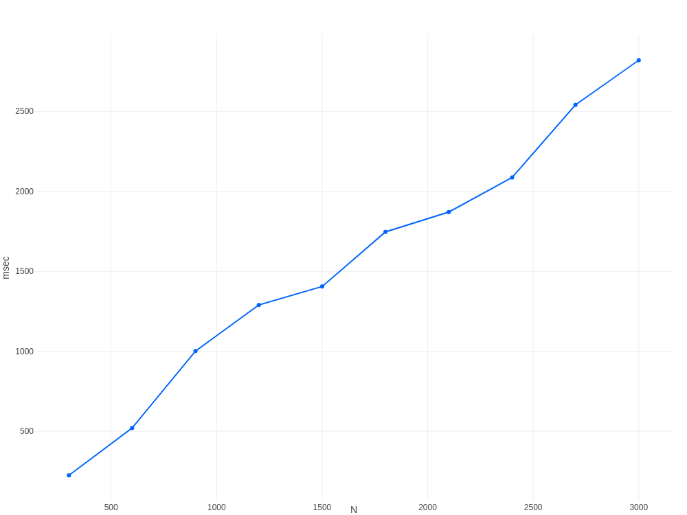

# Lab 1.1

* [Звіт](Lab1.1.pdf)
* [Вихідний код](src/main/kotlin)
* [Результати виконання](res)

## Результат виконання додаткового завдання:
побудуйте графік залежності N від t (де N = 300, 600, 900 ... 3000)

Залежність залишається лінійною, оскільки складність алгоритму O(n * m), де n - кількість дискретних відліків N
(змінна величина, що проходить від 300 до 3000 із кроком 300), m - кількість гармонік
(фіксована величина, 14 000). Таким чином маємо складність O(n * 14000),
що при відкиданні константних значень дає лінійну швидкість зростання часу обчислення O(n).
