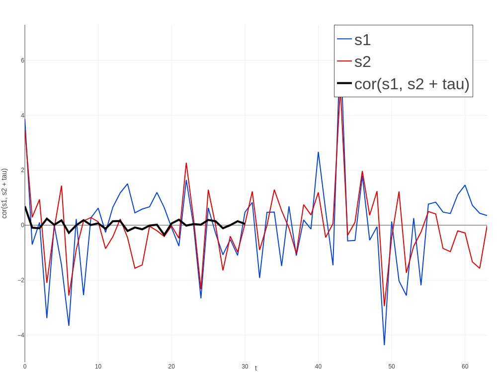
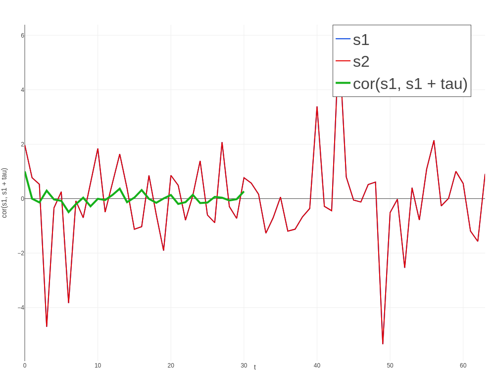

# Lab 1.2

* [Звіт](Lab1.2.pdf)
* [Вихідний код](src/main/kotlin)
* [Результати виконання](res)

## Результати виконання додаткового завдання

Взаємокореляція двох сигналів:

Самокореляція сигналу (s1 i s2 однакові, тому вони наклалися):

Як бачимо, самокореляція при зміщенні 0 дорівнює одиниці. Це підтверджує, що сигнал не змінився.
